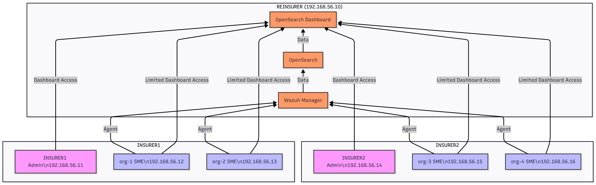

# Wazuh Multi-Tenant PoC for Cyber Insurance

This repository provides a complete, ready-to-run multi-tenant Wazuh Proof of Concept (PoC) suitable for a cyber insurance scenario. It demonstrates how Wazuh can be used in a multi-tenant environment with different organizations and roles, including a reinsurer, insurers, and SME organizations.

## Architecture Overview

The PoC consists of 7 virtual machines organized as follows:

| VM Name           | Role                 | Tenant      | Orgs         | IP            |
|------------------|--------------------|------------|-------------|--------------|
| vm-reinsurer      | REINSURER Admin     | Global     | all orgs    | 192.168.56.10 |
| vm-insurer1-admin | INSURER1 Admin      | INSURER1   | org-1, org-2 | 192.168.56.11 |
| vm-insurer1-org1  | SME org-1           | INSURER1   | org-1       | 192.168.56.12 |
| vm-insurer1-org2  | SME org-2           | INSURER1   | org-2       | 192.168.56.13 |
| vm-insurer2-admin | INSURER2 Admin      | INSURER2   | org-3, org-4 | 192.168.56.14 |
| vm-insurer2-org3  | SME org-3           | INSURER2   | org-3       | 192.168.56.15 |
| vm-insurer2-org4  | SME org-4           | INSURER2   | org-4       | 192.168.56.16 |

- **REINSURER** manages all tenants and dashboards.
- **INSURER1** and **INSURER2** have admin and user roles.
- **SME users** can only see their organization's alerts and insights.
- Wazuh Manager, OpenSearch, and Dashboard run on the REINSURER VM.
- All components are multi-tenant aware.
- Labels are used to differentiate organizations for Document Level Security (DLS).

## Prerequisites

- Windows 10/11 host
- VirtualBox 6.1 or later
- Vagrant 2.2.19 or later
- Git
- At least 16GB RAM
- At least 50GB free disk space

## Quick Start Guide

1. Clone this repository:
   ```
   git clone https://github.com/yourusername/WazuhPoC.git
   cd WazuhPoC
   ```

2. Start all virtual machines:
   ```
   vagrant up
   ```

3. Once all VMs are up, connect to the REINSURER VM and start Wazuh services:
   ```
   vagrant ssh vm-reinsurer
   cd /vagrant/wazuh-docker
   ./scripts/start.sh
   ```

4. Register the agents:
   ```
   # From vm-reinsurer
   sudo /var/ossec/bin/agent-auth -m 192.168.56.10 -A org-1-agent
   sudo /var/ossec/bin/agent-auth -m 192.168.56.10 -A org-2-agent
   sudo /var/ossec/bin/agent-auth -m 192.168.56.10 -A org-3-agent
   sudo /var/ossec/bin/agent-auth -m 192.168.56.10 -A org-4-agent
   ```

5. Configure agents on each SME VM:
   ```
   # For each SME VM (vm-insurer1-org1, etc.)
   vagrant ssh vm-insurer1-org1
   sudo cp /vagrant/wazuh-configs/agents/org1_agent_config.xml /var/ossec/etc/ossec.conf
   sudo systemctl restart wazuh-agent
   ```

6. Set up multi-tenant configuration in OpenSearch Dashboard:
   - Access the dashboard at https://192.168.56.10:5601
   - Log in with admin/admin (change as needed)
   - Import the tenant configurations from `wazuh-configs/tenants/`

7. Run the demo to simulate threats:
   ```
   # From the host machine
   cd demo_scripts
   ./demo_run.sh
   ```

8. View the results in the dashboard:
   - Log in as different users to see role-based access
   - REINSURER admin can see all data
   - INSURER admins can see their organizations' data
   - SME users can only see their own organization's data

## Detailed Setup Instructions

### 1. Host Setup

1. Install VirtualBox from https://www.virtualbox.org/wiki/Downloads
2. Install Vagrant from https://www.vagrantup.com/downloads
3. Install Git from https://git-scm.com/download/win

### 2. Repository Setup

1. Clone the repository:
   ```
   git clone https://github.com/yourusername/WazuhPoC.git
   cd WazuhPoC
   ```

2. Review the Vagrantfile to ensure it matches your environment:
   - Check that the box name is available (`bento/ubuntu-22.04`)
   - Verify IP ranges don't conflict with your network
   - Adjust memory/CPU allocation if needed

3. Start the VMs:
   ```
   vagrant up
   ```
   This will take some time as it downloads the Ubuntu box and provisions all VMs.

### 3. Wazuh Manager Setup

1. Connect to the REINSURER VM:
   ```
   vagrant ssh vm-reinsurer
   ```

2. Navigate to the Wazuh Docker configuration:
   ```
   cd /vagrant/wazuh-docker
   ```

3. Start the Wazuh services:
   ```
   ./scripts/start.sh
   ```
   This will deploy Wazuh Manager, OpenSearch, and Dashboard using Docker Compose.

4. Verify the services are running:
   ```
   docker-compose ps
   ```

5. Access the dashboard at https://192.168.56.10:5601 to confirm it's working.

### 4. Agent Registration and Configuration

1. Register each agent from the REINSURER VM:
   ```
   sudo /var/ossec/bin/agent-auth -m 192.168.56.10 -A org-1-agent
   sudo /var/ossec/bin/agent-auth -m 192.168.56.10 -A org-2-agent
   sudo /var/ossec/bin/agent-auth -m 192.168.56.10 -A org-3-agent
   sudo /var/ossec/bin/agent-auth -m 192.168.56.10 -A org-4-agent
   ```

2. Configure each agent:

   For org-1:
   ```
   vagrant ssh vm-insurer1-org1
   sudo cp /vagrant/wazuh-configs/agents/org1_agent_config.xml /var/ossec/etc/ossec.conf
   sudo systemctl restart wazuh-agent
   ```

   For org-2:
   ```
   vagrant ssh vm-insurer1-org2
   sudo cp /vagrant/wazuh-configs/agents/org2_agent_config.xml /var/ossec/etc/ossec.conf
   sudo systemctl restart wazuh-agent
   ```

   For org-3:
   ```
   vagrant ssh vm-insurer2-org3
   sudo cp /vagrant/wazuh-configs/agents/org3_agent_config.xml /var/ossec/etc/ossec.conf
   sudo systemctl restart wazuh-agent
   ```

   For org-4:
   ```
   vagrant ssh vm-insurer2-org4
   sudo cp /vagrant/wazuh-configs/agents/org4_agent_config.xml /var/ossec/etc/ossec.conf
   sudo systemctl restart wazuh-agent
   ```

3. Verify agents are connected in the Wazuh dashboard.

### 5. Multi-Tenant Configuration

1. Access the OpenSearch Dashboard at https://192.168.56.10:5601

2. Log in with the admin credentials (default: admin/admin)

3. Navigate to Security → Tenants

4. Create the following tenants:
   - INSURER1
   - INSURER2

5. Navigate to Security → Roles

6. Create the following roles with appropriate permissions:
   - reinsurer_admin (full access to all data)
   - insurer1_admin (access to INSURER1 tenant and all org-1 and org-2 data)
   - insurer1_user (access to INSURER1 tenant and only their assigned org data)
   - insurer2_admin (access to INSURER2 tenant and all org-3 and org-4 data)
   - insurer2_user (access to INSURER2 tenant and only their assigned org data)

7. Create the following users and assign the appropriate roles:
   - reinsurer_admin
   - insurer1_admin
   - insurer1_user_org1
   - insurer1_user_org2
   - insurer2_admin
   - insurer2_user_org3
   - insurer2_user_org4

8. Configure Document Level Security (DLS) filters for each role to restrict access based on organization labels.

### 6. Threat Simulation

1. Run the demo script to simulate threats on each SME VM:
   ```
   cd demo_scripts
   ./demo_run.sh
   ```

2. This will execute various threat simulation scripts on each organization's VM:
   - org-1: EICAR ransomware detection and SSH brute-force
   - org-2: Privilege escalation
   - org-3: Network scanning
   - org-4: File modification

3. View the alerts in the Wazuh dashboard as different users to verify the multi-tenant access controls.

## Troubleshooting

### Common Issues

1. **VMs fail to start with "Host-only adapter" error**
   - This is a common issue with VirtualBox networking. Try:
     ```
     vagrant halt
     # In VirtualBox, go to File → Host Network Manager
     # Remove any existing adapters and create a new one
     vagrant up
     ```

2. **Docker containers fail to start**
   - Check Docker is installed and running:
     ```
     vagrant ssh vm-reinsurer
     docker --version
     docker-compose --version
     sudo systemctl status docker
     ```

3. **Agents fail to connect to the manager**
   - Verify network connectivity:
     ```
     # From agent VM
     ping 192.168.56.10
     ```
   - Check agent configuration:
     ```
     # From agent VM
     sudo cat /var/ossec/etc/ossec.conf
     ```
   - Check manager logs:
     ```
     # From manager VM
     docker logs wazuh.manager
     ```

4. **Dashboard is inaccessible**
   - Check if the service is running:
     ```
     # From manager VM
     docker ps | grep wazuh.dashboard
     ```
   - Check firewall rules:
     ```
     # From manager VM
     sudo ufw status
     ```

### Resetting the Environment

If you need to completely reset the environment:

1. Destroy all VMs:
   ```
   vagrant destroy -f
   ```

2. Remove any Docker volumes (from the host):
   ```
   docker volume prune -f
   ```

3. Start again:
   ```
   vagrant up
   ```

## Repository Structure

```
WazuhPoC/
├── README.md                      # This file
├── Vagrantfile                    # Defines all 7 VMs
├── LICENSE                        # Optional license file
├── .gitignore                     # Ignore logs, Vagrant state, temp files
├── wazuh-docker/
│   ├── docker-compose.yml
│   ├── configs/
│   │   ├── ossec.conf
│   │   ├── opensearch_dashboards.yml
│   │   └── custom_rules.xml
│   └── scripts/
│       ├── start.sh
│       ├── stop.sh
│       └── backup.sh
├── simulate_threats/
│   ├── org1/
│   │   ├── eicar_ransomware.sh
│   │   └── ssh_bruteforce.sh
│   ├── org2/
│   │   └── privilege_escalation.sh
│   ├── org3/
│   │   └── network_scan.sh
│   └── org4/
│       └── file_modification.sh
├── demo_scripts/
│   └── demo_run.sh
├── wazuh-configs/
│   ├── agents/
│   │   ├── org1_agent_config.xml
│   │   ├── org2_agent_config.xml
│   │   ├── org3_agent_config.xml
│   │   └── org4_agent_config.xml
│   └── tenants/
│       ├── INSURER1_tenant.json
│       └── INSURER2_tenant.json
└── docs/
    ├── architecture_diagram.png
    └── dashboard_screenshot.png
```

## Architecture Diagram



## Dashboard Screenshots


## Contributing

1. Fork the repository
2. Create a feature branch
3. Make your changes
4. Submit a pull request

## License

This project is licensed under the MIT License - see the LICENSE file for details.
